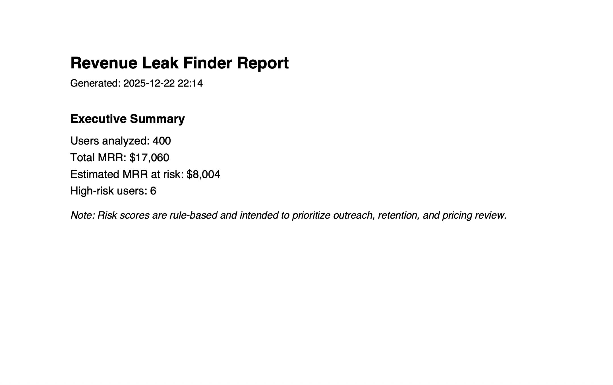

Revenue Leak Finder

Revenue Leak Finder is a lightweight analytics tool that helps subscription businesses identify churn risk, quantify revenue at risk, and surface retention opportunities in clear dollar terms.

Instead of dashboards full of vanity metrics, this tool answers one practical question:

Where are we quietly losing money, and how much is it costing us?

⸻

What It Does

Revenue Leak Finder analyzes basic subscription data and produces:
	•	A command-line summary of revenue exposure
	•	Executive-ready charts showing churn risk
	•	A PDF report designed for leadership review

All outputs focus on revenue impact, not abstract scores.

⸻

Key Insights Generated
	•	Estimated Monthly Revenue at Risk (MRR)
	•	Identification of high-risk customers
	•	Distribution of churn risk across the customer base
	•	A prioritized list of accounts for retention outreach

⸻

Example Output

The tool generates a multi-page PDF report that includes:
	1.	Executive Summary
	•	Users analyzed
	•	Total MRR
	•	Estimated MRR at risk
	•	High-risk user count
	2.	Top Churn Risks
	•	Ranked list of the 10 highest-risk customers
	•	Estimated revenue exposure per account
	3.	Charts
	•	Churn Risk Score Distribution
	•	MRR at Risk by Risk Band (Low, Medium, High)

⸻

How It Works
	•	Rule-based churn scoring using:
	•	Customer inactivity
	•	Usage levels
	•	Discount indicators
	•	Revenue exposure estimated as a function of plan price and risk score
	•	Outputs generated with:
	•	Pandas for analysis
	•	Matplotlib for charts
	•	ReportLab for PDF reporting

The logic is intentionally simple, transparent, and explainable.

⸻

Getting Started

Requirements

Python 3.10 or higher

Install Dependencies

pip install -r requirements.txt

Run the Tool

From the project root:

python -m src.main –input data/sample_data.csv –out reports

Outputs

Charts:
reports/assets/

PDF report:
reports/revenue_report.pdf

⸻

Input Data Schema

The tool expects a CSV file with the following columns:

user_id
plan_price
signup_date
last_active_date
monthly_usage
discount_applied

A synthetic sample dataset is included for demonstration purposes.

⸻

Why This Exists

Most churn analysis tools focus on prediction accuracy.
Revenue Leak Finder focuses on business impact.

The goal is not to build the most complex model, but to give decision-makers a clear answer to:

How much revenue is at risk right now, and which customers should we act on first?

⸻

Project Status

This project is a functional prototype designed to demonstrate:
	•	Business-driven problem solving
	•	Clean Python architecture
	•	End-to-end product delivery